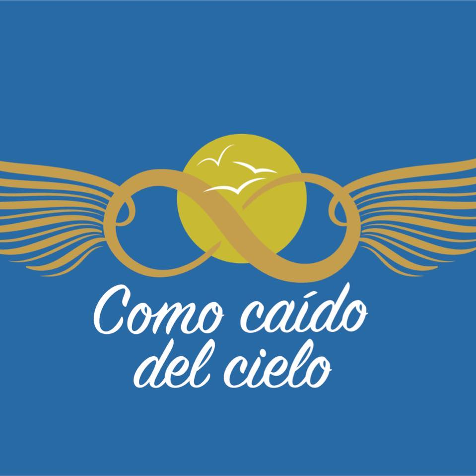

<p align="center">
  
</p>

<h1 align="center">🌅 Como Caído del Cielo</h1>

<p align="center">
  <strong>Donde el paisaje se convierte en experiencia</strong>
</p>

<p align="center">
  <em>Sitio web inmersivo para un destino experiencial ubicado en Nicoya, Guanacaste — Costa Rica.</em>
</p>

<p align="center">
  
  
  
  
  
  
  
</p>

---

## 📋 Tabla de Contenidos

- [Sobre el Proyecto](#-sobre-el-proyecto)
- [Concepto y Enfoque](#-concepto-y-enfoque)
- [Demo](#-demo)
- [Tech Stack](#-tech-stack)
- [Arquitectura del Proyecto](#-arquitectura-del-proyecto)
- [Secciones de la Página](#-secciones-de-la-página)
- [Componentes](#-componentes)
- [Sistema de Diseño](#-sistema-de-diseño)
- [Características Técnicas](#-características-técnicas)
- [Instalación y Uso](#-instalación-y-uso)
- [Scripts Disponibles](#-scripts-disponibles)
- [Despliegue](#-despliegue)
- [Estructura de Archivos](#-estructura-de-archivos)
- [Dependencias Principales](#-dependencias-principales)
- [Contribución](#-contribución)
- [Licencia](#-licencia)

---

## 🌄 Sobre el Proyecto

**Como Caído del Cielo** no es una landing page tradicional — es una **experiencia digital inmersiva** diseñada para transportar al visitante al corazón de un destino único en las montañas de Nicoya, Guanacaste, Costa Rica.

El sitio web guía al usuario a través de un **recorrido virtual narrativo** por cada espacio del lugar: terrazas con vistas al Golfo de Nicoya, fogatas bajo las estrellas, gastronomía con alma, eventos vibrantes, un salón de eventos privado y hospedaje tipo Airbnb inmerso en la naturaleza.

### ¿Por qué este proyecto?

> Este proyecto fue concebido con la filosofía de que una página web debe **hacer sentir**, no solo informar. Cada sección está diseñada para transmitir las sensaciones reales del lugar: la brisa del atardecer, el calor de la fogata, la energía de una noche de DJ y la tranquilidad del amanecer.

---

## 🎯 Concepto y Enfoque

### Filosofía de Diseño

| Principio | Descripción |
|---|---|
| **Comunicación natural** | Evita el estilo de catálogo frío. Se comunica como si hablaras con alguien que te está invitando |
| **Transmisión de sensaciones** | Cada sección enfoca lo que se **vive** en cada espacio, no solo lo que se ve |
| **Recorrido fluido** | El diseño invita a seguir explorando paso a paso, contando una historia |
| **Inmersión visual** | Fotografías reales del lugar como protagonistas, acompañadas de narrativas emotivas |

### Flujo de la Experiencia

```
Hero (Impacto emocional)
  │
  ├── Terrazas (El corazón del lugar)
  │     ├── Atardeceres Únicos
  │     ├── Tipos de Terrazas
  │     ├── Fogatas y Magia Nocturna
  │     └── Vistas Panorámicas
  │
  ├── Food Truck (Gastronomía con alma)
  │
  ├── Eventos (Noches que cobran vida)
  │
  ├── Salón de Eventos (Espacio privado)
  │
  ├── Hospedaje Airbnb (Extiende tu experiencia)
  │
  ├── Momentos Reales (Galería de vida)
  │
  ├── Información Práctica (Logística)
  │
  └── Asistente Inteligente (Chat en vivo)
```

---

## 🖥️ Demo

> 🔗 **[Ver sitio en vivo](https://como-caido-del-cielo.vercel.app)**   *(desplegado en Vercel)*

---

## 🛠️ Tech Stack

### Frontend Core

| Tecnología | Versión | Uso |
|---|---|---|
| **React** | 18.3.1 | Biblioteca de UI principal |
| **TypeScript (TSX)** | — | Tipado estático para todos los componentes |
| **Vite** | 6.3.5 | Bundler ultrarrápido con HMR |
| **Tailwind CSS** | 4.1.12 | Framework de utilidades CSS (vía `@tailwindcss/vite`) |

### Animaciones y Movimiento

| Tecnología | Versión | Uso |
|---|---|---|
| **Motion (Framer Motion)** | 12.23.24 | Animaciones declarativas, transiciones de scroll, `useInView` |
| **tw-animate-css** | 1.3.8 | Extensiones de animación para Tailwind |

### Componentes UI

| Tecnología | Versión | Uso |
|---|---|---|
| **Radix UI** | Múltiples | Componentes headless accesibles (Accordion, Dialog, Tabs, etc.) |
| **Lucide React** | 0.487.0 | Sistema de íconos SVG consistente |
| **MUI (Material UI)** | 7.3.5 | Íconos materiales complementarios |
| **shadcn/ui** | — | 48 componentes UI reutilizables preconstruidos |

### Carouseles y Galerías

| Tecnología | Versión | Uso |
|---|---|---|
| **Embla Carousel** | 8.6.0 | Carrusel de imágenes táctil y accesible |
| **React Responsive Masonry** | 2.7.1 | Galería tipo masonry responsiva |
| **React Slick** | 0.31.0 | Slider de contenido |

### Utilidades

| Tecnología | Versión | Uso |
|---|---|---|
| **class-variance-authority** | 0.7.1 | API declarativa para variantes de componentes |
| **clsx** | 2.1.1 | Composición condicional de clases |
| **tailwind-merge** | 3.2.0 | Merge inteligente de clases Tailwind |
| **date-fns** | 3.6.0 | Manipulación de fechas |
| **zod** | 4.3.6 | Validación de esquemas y tipos |
| **sonner** | 2.0.3 | Sistema de notificaciones toast |
| **canvas-confetti** | 1.9.4 | Efectos de confetti para celebraciones |
| **vitest** | 4.1.2 | Framework de testing (Unit/Integration) |
| **jsdom** | — | Entorno de simulación de DOM para tests |
| **react-hook-form** | 7.55.0 | Manejo de formularios |
| **react-router** | 7.13.0 | Enrutamiento (preparado para expansión) |

---

## 🏗️ Arquitectura del Proyecto

```
ComoCaidoDelCielo/
├── 📁 assets/                    # Recursos estáticos
│   ├── 📁 Galeria/               # Imágenes de galería
│   ├── 📁 SalonEventos/          # Fotos del salón de eventos (6 imágenes)
│   └── 📁 logo/                  # Logo del negocio
│       └── logo.jpg
├── 📁 guidelines/                # Directrices de diseño
│   └── Guidelines.md
├── 📁 src/
│   ├── 📄 main.tsx               # Punto de entrada de React
│   ├── 📁 app/
│   │   ├── 📄 App.tsx            # Componente raíz
│   │   └── 📁 components/
│   │       ├── 📁 navbar/                # Nueva estructura modular
│   │       │   ├── Navbar.tsx            # Orquestador
│   │       │   ├── NavbarAuthPanel.tsx   # Lógica Supabase Auth
│   │       │   └── NavbarMobileMenu.tsx  # Menú móvil animado
│   │       ├── 📄 Hero.tsx
│   │       ├── 📄 TerraceSection.tsx
│   │       ├── 📄 AirbnbSection.tsx
│   │       ├── 📄 AirbnbModal.tsx
│   │       └── ...
│   ├── 📁 lib/                   # Servicios Core
│   │   ├── 📄 supabase.ts        # Cliente Supabase
│   │   ├── 📄 errorHandler.ts    # Manejo de errores centralizado
│   │   └── 📄 adminSchemas.ts    # Esquemas Zod
│   ├── 📁 utils/                 # Lógica Pura (Testeable)
│   │   ├── 📄 reservation-logic.ts
│   │   └── 📄 reservation-logic.test.ts
│   ├── 📁 data/                  # Single Source of Truth
│   │   ├── 📄 airbnbData.ts
│   │   └── 📄 terraceNarratives.ts
│   │           ├── accordion.tsx
│   │           ├── button.tsx
│   │           ├── card.tsx
│   │           ├── carousel.tsx
│   │           ├── dialog.tsx
│   │           ├── ...y 43 más
│   │           ├── use-mobile.ts         # Hook para detección de dispositivos
│   │           └── utils.ts              # Utilidades (cn helper)
│   ├── 📁 imports/
│   │   └── 📁 pasted_text/              # Textos y contenido importado
│   └── 📁 styles/
│       ├── 📄 index.css                  # CSS principal (imports + scrollbar custom)
│       ├── 📄 fonts.css                  # Tipografías
│       ├── 📄 tailwind.css               # Configuración de Tailwind
│       └── 📄 theme.css                  # Sistema de tokens de diseño
├── 📄 index.html                  # Template HTML
├── 📄 package.json                # Dependencias y scripts
├── 📄 vite.config.ts              # Configuración de Vite
├── 📄 postcss.config.mjs          # Configuración de PostCSS
├── 📄 .gitignore                  # Archivos ignorados por Git
└── 📄 README.md                   # Este archivo
```

---

## 📱 Secciones de la Página

### 1. 🌟 Hero Principal
Impacto emocional desde el primer segundo. Imagen a pantalla completa de un atardecer sobre el Golfo de Nicoya con overlay gradiente. Incluye:
- Título animado con Motion: *"Donde el paisaje se convierte en experiencia"*
- Subtítulo emotivo
- Dos CTAs: "Explorar la experiencia" y "Consultar disponibilidad"
- Indicador de scroll animado (flecha pulsante)

### 2. 🏖️ Terrazas — *El corazón de la experiencia*
La sección más extensa y narrativa del sitio, subdividida en **4 experiencias sensoriales**:

| Sub-experiencia | Contenido |
|---|---|
| **Atardeceres Únicos** | Narrativa paso a paso del Golden Hour (5:00–6:30 PM) con imagen sticky del golfo |
| **Tipos de Terrazas** | Galería de 4 opciones: Íntimas (2-4 pers.), Familiares (6-10), Celebración (12-20), VIP |
| **Fogatas y Magia Nocturna** | El ritual del encendido, conexión bajo estrellas. Incluye: leña premium, malvaviscos, mantas |
| **Vistas Panorámicas** | Golfo de Nicoya en 360°, montañas, datos: altura 150m, amanecer 5:30 AM |

### 3. 🍔 Food Truck — *Gastronomía con alma*
Presentación del food truck con enfoque en experiencias gastronómicas especiales. Layout de 2 columnas con texto narrativo e imágenes.

### 4. 🎶 Eventos — *Cuando la noche cobra vida*
Grid de 3 columnas mostrando: DJs en vivo, Tardeos especiales y Noches memorables. CTA para calendario de eventos.

### 5. 🏛️ Salón de Eventos — *Tu espacio privado*
Sección con fondo oscuro (`#2A2419`), galería de 5 fotos reales del salón, 3 cards de usos:
- Celebraciones especiales (cumpleaños, aniversarios)
- Retiros y corporativos
- Totalmente adaptable

Incluye **integración con el chatbot**: el botón "Solicitar disponibilidad" abre automáticamente el chat con un mensaje predefinido vía `CustomEvent`.

### 6. 🏡 Hospedaje Airbnb — *Extiende tu experiencia*
Cabaña en Nicoya, Guanacaste con jacuzzi, fogatas y hasta 6 huéspedes. Incluye:
- Grid de 2 imágenes con hover zoom
- 3 features: Descanso profundo, Entorno natural, Como en casa
- **Modal detallado** (AirbnbModal) con:
  - Galería de imágenes con thumbnails y navegación
  - Categorías de amenidades (Alojamiento, Cocina, Exterior, Servicios)
  - Características de ubicación
  - Pricing: Desde $85 USD/noche, mínimo 2 noches

### 7. 📸 Momentos Reales — *Galería de vida*
Galería masonry responsiva que combina imágenes de todas las secciones. Incluye cita testimonial destacada.

### 8. ℹ️ Información Práctica
4 cards con glassmorphism sobre fondo oscuro:
- 📍 **Ubicación**: 45 min de la ciudad, fácil acceso
- 🕐 **Horarios**: Viernes a domingo, 2:00–10:00 PM
- 📅 **Temporada**: Abierto todo el año
- ⚠️ **Importante**: Reserva anticipada, cupo limitado

Banner CTA para hablar con el asistente.

### 9. 💬 Asistente Inteligente (Chat)
Chatbot flotante siempre accesible:
- Botón flotante con animación whileHover/whileTap
- Ventana de chat con header corporativo
- Respuestas automáticas pre-programadas
- **Escucha eventos personalizados** (`open-chat`) para abrir con mensajes pre-cargados desde otras secciones

### 10. 🧭 Navbar Adaptativa
Barra de navegación que cambia de estilo con el scroll:
- **Arriba**: Transparente con texto blanco sobre el hero
- **Al scrollear**: Fondo blanco con blur, shadow y texto oscuro
- Menú móvil con AnimatePresence
- Botón de "Reservar" con estilo adaptativo

### 11. 📍 Footer
Pie de página con 3 columnas: Brand + Redes sociales, Contacto (teléfono/email), Enlaces rápidos.

---

## 🧩 Componentes

### Componentes de Sección (12)

| Componente | Archivo | Tamaño | Descripción |
|---|---|---|---|
| `Navbar` | `Navbar.tsx` | 3.6 KB | Nav adaptativa con scroll detection |
| `Hero` | `Hero.tsx` | 2.9 KB | Hero full-screen con animaciones |
| `TerraceSection` | `TerraceSection.tsx` | 27.6 KB | Sección más compleja: 4 experiencias narrativas |
| `FoodTruckSection` | `FoodTruckSection.tsx` | 3.7 KB | Sección gastronómica |
| `EventsSection` | `EventsSection.tsx` | 3.9 KB | Galería de eventos |
| `EventHallSection` | `EventHallSection.tsx` | 8.6 KB | Salón de eventos con integración chatbot |
| `AirbnbSection` | `AirbnbSection.tsx` | 4.5 KB | Sección de hospedaje |
| `AirbnbModal` | `AirbnbModal.tsx` | 14.7 KB | Modal detallado tipo Airbnb |
| `MomentsGallery` | `MomentsGallery.tsx` | 2.7 KB | Galería masonry |
| `InfoSection` | `InfoSection.tsx` | 3.9 KB | Información del lugar |
| `ChatAssistant` | `ChatAssistant.tsx` | 4.8 KB | Chatbot flotante |
| `Footer` | `Footer.tsx` | 3.0 KB | Pie de página |

### Componentes UI (shadcn/ui) — 48 componentes

La carpeta `ui/` contiene una biblioteca completa de componentes UI headless y accesibles basados en Radix UI:

<details>
<summary>📦 Ver todos los 48 componentes UI</summary>

| Componente | Archivo |
|---|---|
| Accordion | `accordion.tsx` |
| Alert | `alert.tsx` |
| Alert Dialog | `alert-dialog.tsx` |
| Aspect Ratio | `aspect-ratio.tsx` |
| Avatar | `avatar.tsx` |
| Badge | `badge.tsx` |
| Breadcrumb | `breadcrumb.tsx` |
| Button | `button.tsx` |
| Calendar | `calendar.tsx` |
| Card | `card.tsx` |
| Carousel | `carousel.tsx` |
| Chart | `chart.tsx` |
| Checkbox | `checkbox.tsx` |
| Collapsible | `collapsible.tsx` |
| Command | `command.tsx` |
| Context Menu | `context-menu.tsx` |
| Dialog | `dialog.tsx` |
| Drawer | `drawer.tsx` |
| Dropdown Menu | `dropdown-menu.tsx` |
| Form | `form.tsx` |
| Hover Card | `hover-card.tsx` |
| Input | `input.tsx` |
| Input OTP | `input-otp.tsx` |
| Label | `label.tsx` |
| Menubar | `menubar.tsx` |
| Navigation Menu | `navigation-menu.tsx` |
| Pagination | `pagination.tsx` |
| Popover | `popover.tsx` |
| Progress | `progress.tsx` |
| Radio Group | `radio-group.tsx` |
| Resizable | `resizable.tsx` |
| Scroll Area | `scroll-area.tsx` |
| Select | `select.tsx` |
| Separator | `separator.tsx` |
| Sheet | `sheet.tsx` |
| Sidebar | `sidebar.tsx` |
| Skeleton | `skeleton.tsx` |
| Slider | `slider.tsx` |
| Sonner | `sonner.tsx` |
| Switch | `switch.tsx` |
| Table | `table.tsx` |
| Tabs | `tabs.tsx` |
| Textarea | `textarea.tsx` |
| Toggle | `toggle.tsx` |
| Toggle Group | `toggle-group.tsx` |
| Tooltip | `tooltip.tsx` |
| use-mobile | `use-mobile.ts` |
| utils | `utils.ts` |

</details>

### Componentes Auxiliares

| Componente | Archivo | Descripción |
|---|---|---|
| `ImageWithFallback` | `figma/ImageWithFallback.tsx` | Wrapper de `` con fallback SVG ante errores de carga |

---

## 🎨 Sistema de Diseño

### Paleta de Colores

| Token | Color | Hex | Uso |
|---|---|---|---|
| `--background` | 🟫 Crema suave | `#FBF8F3` | Fondo principal |
| `--foreground` | ⬛ Marrón oscuro | `#2A2419` | Texto principal |
| `--primary` | 🟤 Marrón dorado | `#8B6F47` | Botones, acciones principales |
| `--secondary` | 🟡 Dorado claro | `#D4A574` | Acciones secundarias |
| `--accent` | ✨ Dorado | `#C89F6A` | Acentos, badges, highlights |
| `--muted` | 🏜️ Arena | `#E8DED0` | Fondos secundarios, bordes |
| `--muted-foreground` | 🟫 Marrón medio | `#6B5D4F` | Texto secundario |
| Secciones oscuras | ⬛ Noche | `#2A2419` | Salón de eventos, Info |
| Accent gold (terrazas) | 🌟 Canela | `#C19A6B` | Narrativas, numeración |
| Hover dark | ⬛ Carbón | `#332D26` | Cards en secciones oscuras |

### Tipografía

- **Base font-size**: `16px` (configurable via `--font-size`)
- **Headings**: `font-weight: 500` (medium)
- **Body**: `font-weight: 400` (normal)
- Jerarquía: `h1` → `2xl`, `h2` → `xl`, `h3` → `lg`, `h4` → `base`

### Espaciado y Bordes

- Border-radius base: `0.625rem` (10px)
- Secciones: `py-24 px-6 md:px-12`
- Max content width: `max-w-7xl` (1280px)
- Cards: `rounded-2xl` a `rounded-3xl`

### Modo Oscuro

El sistema de diseño incluye soporte completo para **dark mode** vía CSS custom properties y la variante `dark` de Tailwind.

---

## ⚡ Características Técnicas

### Animaciones

- **Scroll-triggered animations**: Cada sección usa `useInView` de Motion para animar al entrar en viewport
- **Staggered reveals**: Elementos secundarios aparecen con delays incrementales (`delay: 0.2, 0.4, 0.6...`)
- **Hover interactions**: Scale, translate y color transitions en imágenes y botones
- **Scroll indicator**: Flecha pulsante infinita en el hero
- **Chat animations**: `AnimatePresence` para open/close con spring physics

### Comunicación entre Componentes

El sistema usa **Custom Events** nativos del DOM para comunicación desacoplada:

```typescript
// Disparar desde EventHallSection
const event = new CustomEvent("open-chat", {
  detail: { message: "Quiero consultar disponibilidad" }
});
window.dispatchEvent(event);

// Escuchar en ChatAssistant
window.addEventListener("open-chat", handleOpenChat);
```

### Responsividad

- **Mobile-first**: Diseño base para móviles, escalado con `md:` y `lg:`
- **Navbar colapsable**: Menú hamburguesa en pantallas `< md`
- **Grids adaptativos**: `grid-cols-1` → `md:grid-cols-2` → `lg:grid-cols-4`
- **Imágenes responsive**: `object-cover` en todas las galerías
- **Custom hook**: `use-mobile.ts` para detección de dispositivo

### UX / Accesibilidad

- Smooth scroll nativo: `html { scroll-behavior: smooth; }`
- Custom scrollbar en WebKit con colores de la marca
- `aria-label` en botones de navegación del modal
- Gradientes de overlay para legibilidad de texto sobre imágenes
- Backdrop blur en navbar y cards para efecto glassmorphism

### ⚙️ Automatización e Integración (n8n + Supabase)
El proyecto utiliza un flujo de trabajo moderno para la gestión de clientes:
- **Supabase Auth**: Autenticación Google One-Tap y OTP.
- **n8n Webhooks**: Notificaciones automáticas de reservas y sincronización con bases de datos internas.
- **Security hardening**: Implementación de remediaciones CAPEC para asegurar que solo webhooks autorizados interactúen con el servidor.

### 🧪 Calidad de Código y Testing
Alineado con los estándares de **SonarQube (Grado A)**:
- **Pruebas Unitarias**: Suite de tests con Vitest para validaciones críticas.
- **Desacoplamiento**: Separación estricta entre lógica de negocio (`utils/`) y presentación (`components/`).
- **Manejo de Errores**: Servicio centralizado (`errorHandler.ts`) para una mejor observabilidad.

---

## 🚀 Instalación y Uso

### Prerequisitos

- **Node.js** ≥ 18.x
- **npm** ≥ 9.x (o pnpm)

### Instalación

```bash
# 1. Clonar el repositorio
git clone https://github.com/JosueChaves01/ComoCaidoDelCielo.git

# 2. Entrar al directorio
cd ComoCaidoDelCielo

# 3. Instalar dependencias
npm install

# 4. Iniciar servidor de desarrollo
npm run dev
```

El servidor se levantará en `http://localhost:5173` con Hot Module Replacement habilitado.

---

## 📜 Scripts Disponibles

| Script | Comando | Descripción |
|---|---|---|
| **Dev** | `npm run dev` | Inicia Vite en modo desarrollo con HMR |
| **Build** | `npm run build` | Genera el bundle de producción en `/dist` |

---

## 🌐 Despliegue

El proyecto está configurado para desplegarse en **Vercel**:

1. Conecta tu repositorio de GitHub a Vercel
2. Vercel detectará automáticamente la configuración de Vite
3. **Build Command**: `vite build`
4. **Output Directory**: `dist`
5. **Framework Preset**: Vite

> **Nota**: Asegúrate de que la versión de Node.js en Vercel sea ≥ 18.x

---

## 📁 Estructura de Archivos

```
src/
├── main.tsx                        # Entry point — monta <App /> en #root
├── app/
│   ├── App.tsx                     # Componente raíz
│   │   • Define todas las URLs de imágenes
│   │   • Orquesta el orden de secciones
│   │   • Pasa props de imágenes a cada componente
│   └── components/
│       ├── Navbar.tsx              # Nav con scroll detection
│       ├── Hero.tsx                # Hero full-screen
│       ├── TerraceSection.tsx      # 569 líneas — la más detallada
│       ├── FoodTruckSection.tsx    # Gastronomía
│       ├── EventsSection.tsx       # Eventos y música
│       ├── EventHallSection.tsx    # Salón privado + chatbot trigger
│       ├── AirbnbSection.tsx       # Hospedaje
│       ├── AirbnbModal.tsx         # Modal detallado (323 líneas)
│       ├── MomentsGallery.tsx      # Galería masonry
│       ├── InfoSection.tsx         # Info práctica
│       ├── ChatAssistant.tsx       # Chat con Custom Events
│       ├── Footer.tsx              # Footer 3-columnas
│       ├── figma/
│       │   └── ImageWithFallback.tsx
│       └── ui/                     # 48 componentes shadcn/ui
└── styles/
    ├── index.css                   # Imports + custom scrollbar
    ├── fonts.css                   # Web fonts
    ├── tailwind.css                # Setup de Tailwind
    └── theme.css                   # Design tokens (181 líneas)
```

---

## 📦 Dependencias Principales

### Producción (35 dependencias)

<details>
<summary>Ver listado completo</summary>

| Paquete | Versión | Categoría |
|---|---|---|
| `react` / `react-dom` | 18.3.1 | Core |
| `motion` | 12.23.24 | Animaciones |
| `lucide-react` | 0.487.0 | Íconos |
| `@mui/material` | 7.3.5 | Componentes Material |
| `@emotion/react` / `@emotion/styled` | 11.14.x | CSS-in-JS (dep. de MUI) |
| `@radix-ui/*` (18 paquetes) | 1.x–2.x | Primitivos UI accesibles |
| `embla-carousel-react` | 8.6.0 | Carrusel |
| `react-responsive-masonry` | 2.7.1 | Galería masonry |
| `react-slick` | 0.31.0 | Slider |
| `react-router` | 7.13.0 | Routing |
| `react-hook-form` | 7.55.0 | Formularios |
| `class-variance-authority` | 0.7.1 | Variantes de componentes |
| `clsx` | 2.1.1 | Clases condicionales |
| `tailwind-merge` | 3.2.0 | Merge de clases |
| `canvas-confetti` | 1.9.4 | Efectos visuales |
| `sonner` | 2.0.3 | Toasts |
| `date-fns` | 3.6.0 | Fechas |
| `vaul` | 1.1.2 | Drawer |
| `cmdk` | 1.1.1 | Command palette |

</details>

### Desarrollo (4 dependencias)

| Paquete | Versión | Uso |
|---|---|---|
| `vite` | 6.3.5 | Bundler |
| `@vitejs/plugin-react` | 4.7.0 | Plugin React para Vite |
| `tailwindcss` | 4.1.12 | Framework CSS |
| `@tailwindcss/vite` | 4.1.12 | Plugin Tailwind para Vite |

---

### Convenciones

- **Componentes**: PascalCase (`TerraceSection.tsx`)
- **Archivos UI**: kebab-case (`alert-dialog.tsx`)
- **Commits**: Conventional Commits (`feat:`, `fix:`, `docs:`, `style:`)
- **Estilos**: Tailwind CSS utilities, no CSS inline ni módulos CSS

---

## 📄 Licencia

© 2026 **Como Caído del Cielo**. Todos los derechos reservados.

Proyecto desarrollado como sitio web comercial para el establecimiento *Como Caído del Cielo* — Costa Rica.

---

<p align="center">
  <strong>Hecho con ❤️ y atardeceres costarricenses 🌅</strong>
</p>
